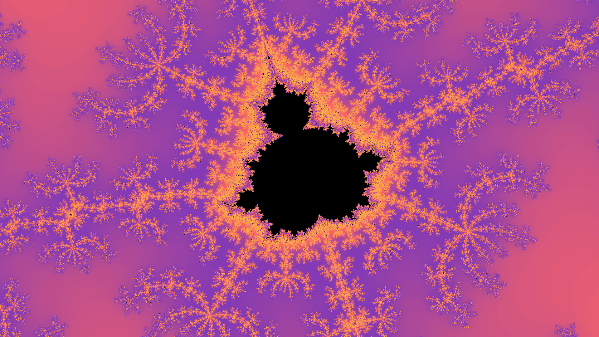

# FractalGenerator
#### Description
A command line based fractal renderer, which uses multiprocessing to quickly render awesome images of fractals. The user has full control over the rendering of the image being able to choose render size, location, zoom, iterations, and even the colormap used.
#### Example Usage
The following image was generated by using the following command.
```
python3 main.py -0.3702461674528304 0.6487461306014151 1024 1920 1080 600 instagram
```

#### Reasoning
